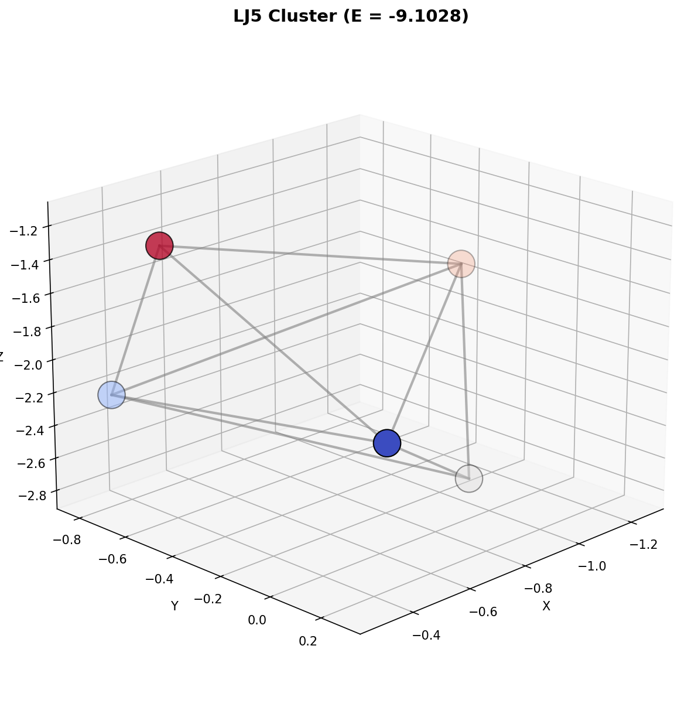
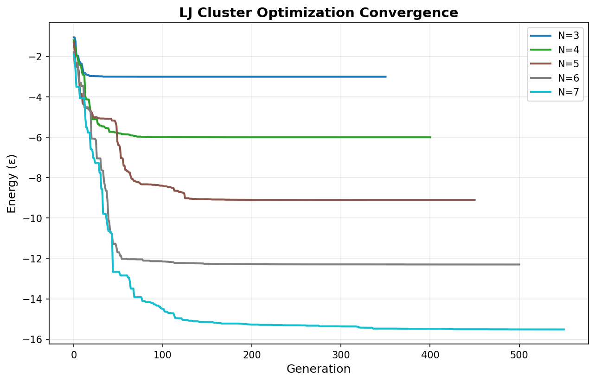
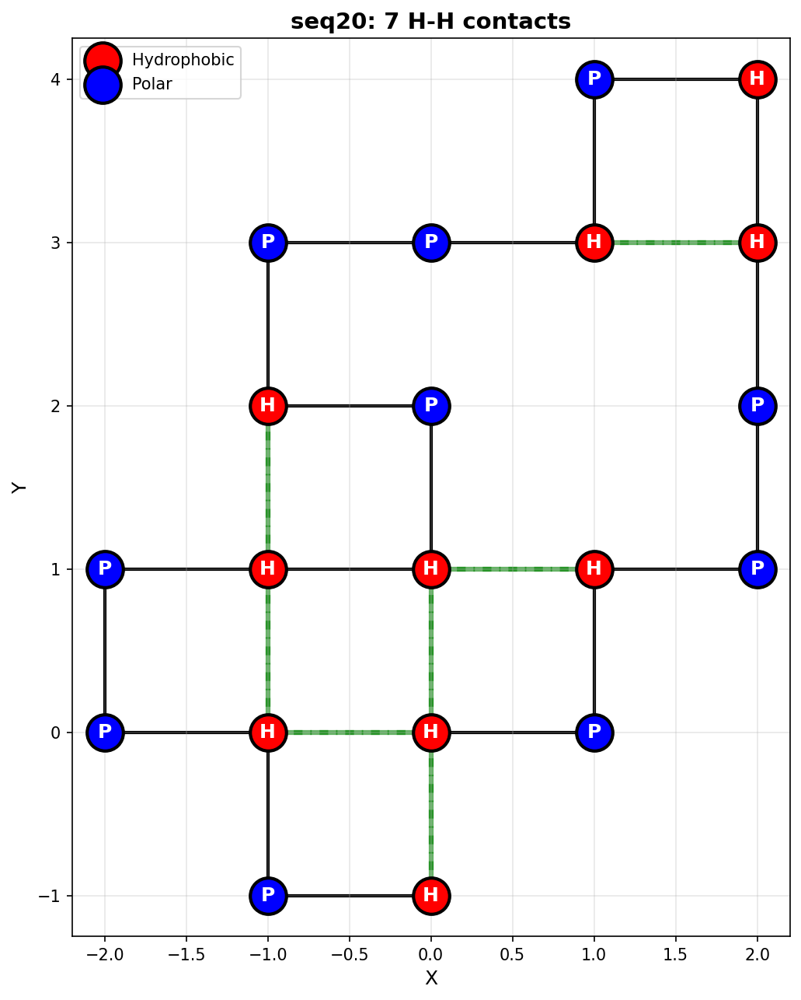
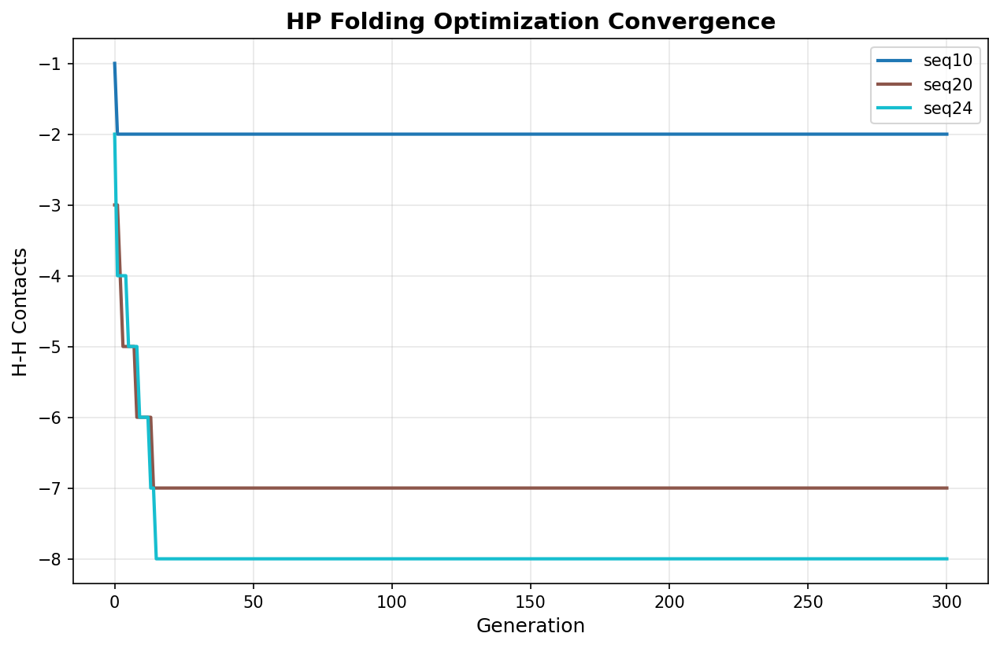
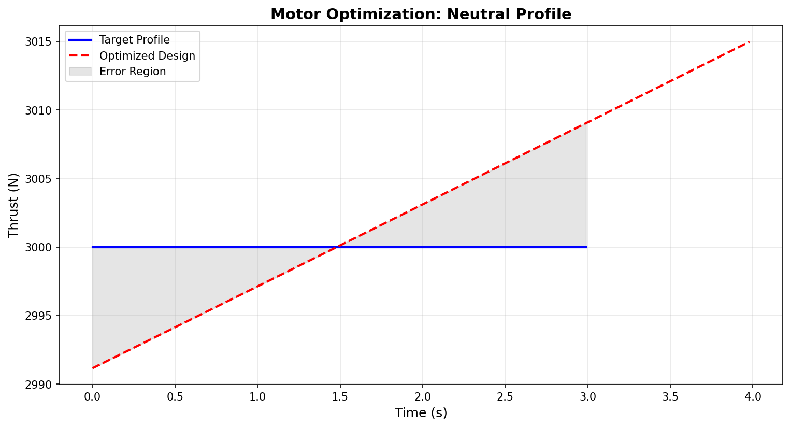
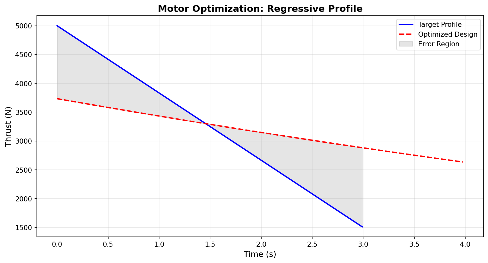
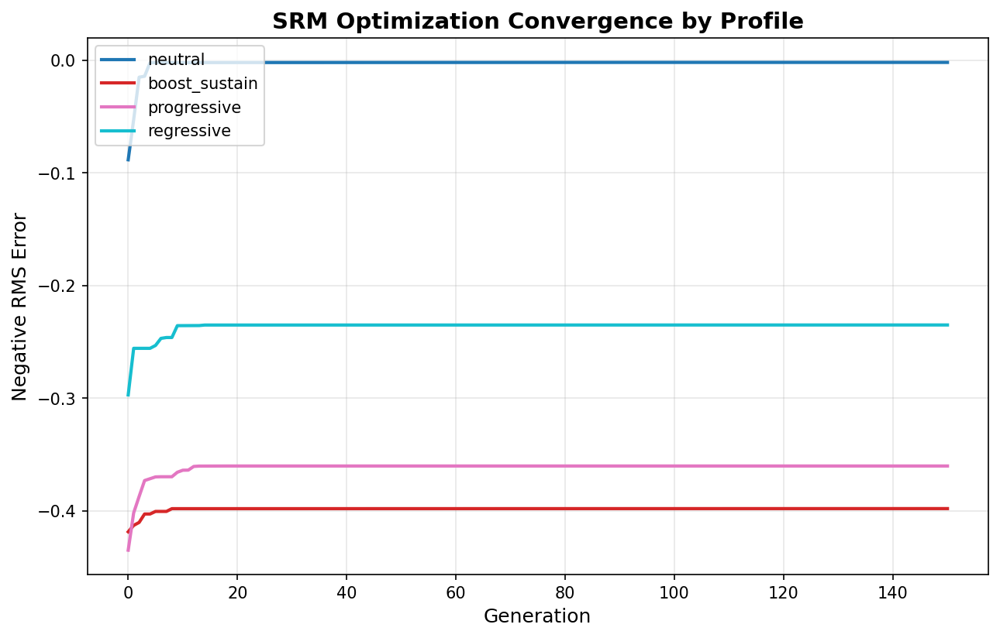
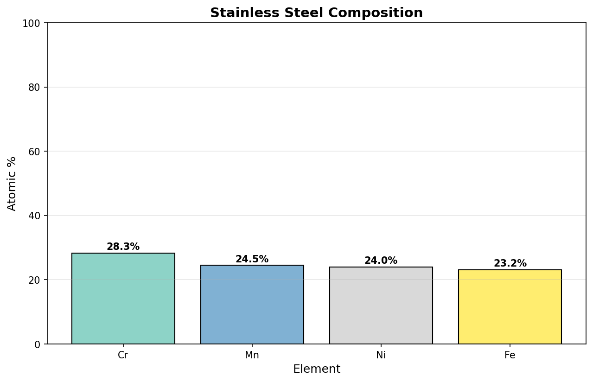
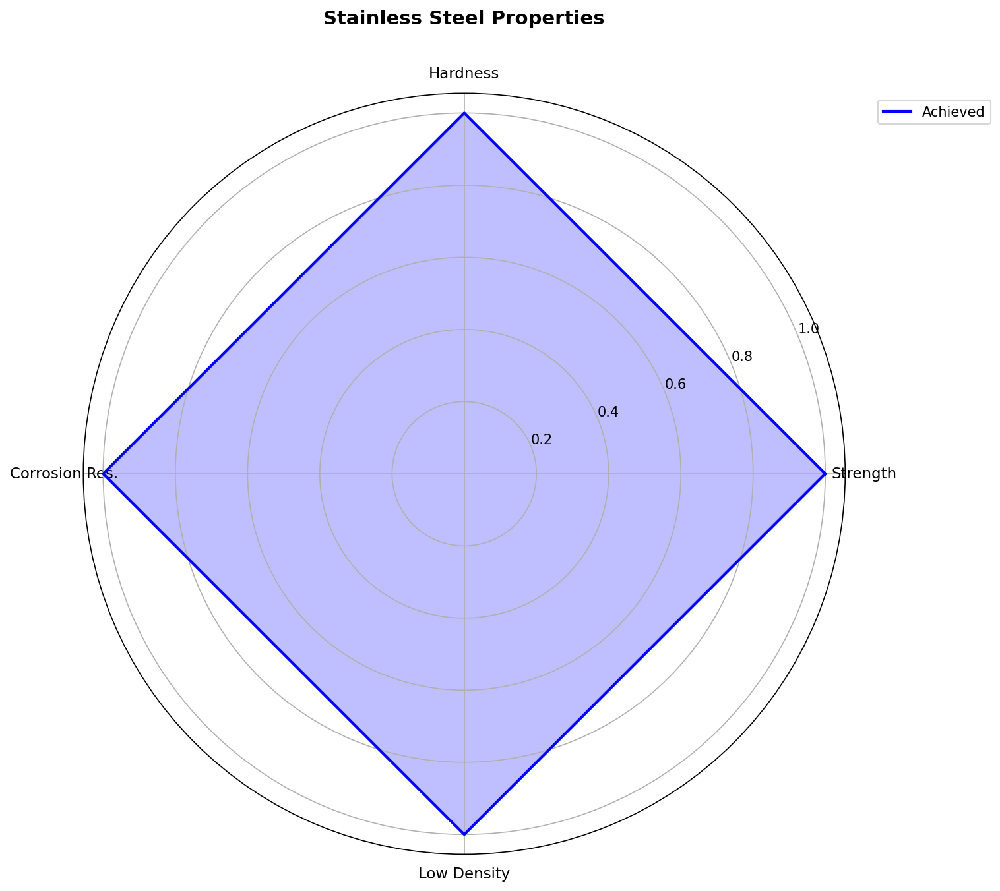
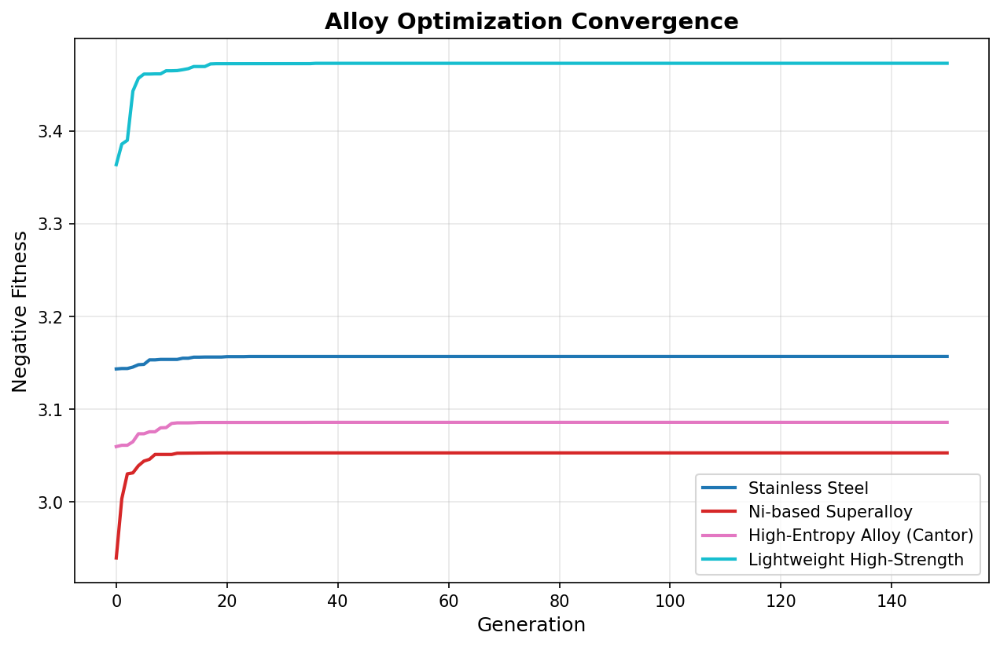

# ParGA Scientific Case Studies

This directory contains four scientific optimization case studies demonstrating ParGA's capabilities across different domains. Each example represents a real-world optimization problem solved using genetic algorithms.

## Quick Start

Run any example:
```bash
# Install dependencies
pip install parga matplotlib numpy

# Run examples
python examples/lennard_jones_clusters.py
python examples/protein_hp_folding.py
python examples/rocket_motor_optimization.py
python examples/alloy_composition_optimization.py

# Compare single GA vs island model
python examples/lennard_jones_clusters.py --compare
```

All examples save visualizations to `examples/output/`.

---

## 1. Lennard-Jones Cluster Optimization

**Domain:** Computational Physics / Chemistry

**File:** [`lennard_jones_clusters.py`](lennard_jones_clusters.py)

### Background

The Lennard-Jones potential describes van der Waals interactions between neutral atoms:

$$V(r) = 4\varepsilon \left[ \left(\frac{\sigma}{r}\right)^{12} - \left(\frac{\sigma}{r}\right)^{6} \right]$$

Finding the global minimum energy configuration of N atoms is a classic NP-hard benchmark problem. The number of local minima grows exponentially with cluster size, making it an ideal test for global optimization algorithms.

### The Problem

Given N atoms, find the 3D coordinates that minimize total potential energy. We optimize `3×N` continuous variables (x, y, z for each atom).

### Results

| N atoms | Found Energy | Known Global Min | Error |
|---------|--------------|------------------|-------|
| 3 | -3.000000 | -3.000000 | 0.00% |
| 4 | -5.999931 | -6.000000 | 0.00% |
| 5 | -9.102770 | -9.104000 | 0.01% |
| 6 | -12.300152 | -12.712000 | 3.24% |
| 7 | -15.516557 | -16.505000 | 5.99% |

ParGA finds near-optimal solutions for smaller clusters and reasonable approximations for larger ones. The difficulty increases exponentially with cluster size.

### Visualizations

**3D Cluster Configurations:**



**Convergence Comparison:**



### References
- Wales, D.J. & Doye, J.P.K. (1997) "Global Optimization by Basin-Hopping"
- Cambridge Cluster Database: http://www-wales.ch.cam.ac.uk/CCD.html

---

## 2. Protein HP Lattice Folding

**Domain:** Computational Biology

**File:** [`protein_hp_folding.py`](protein_hp_folding.py)

### Background

The HP (Hydrophobic-Polar) model is a simplified representation of protein folding:
- Amino acids are classified as **H** (hydrophobic) or **P** (polar)
- The protein chain is embedded on a 2D lattice
- Energy is minimized by maximizing H-H contacts (non-sequential neighbors)

This NP-hard problem captures the essential physics of protein folding: hydrophobic residues cluster together to form a "core," mimicking real protein behavior.

### The Problem

Given an HP sequence (e.g., "HPHPPHHPHP"), find a self-avoiding walk on a 2D lattice that maximizes H-H contacts. We optimize N-1 discrete moves (forward, left, right) encoded as continuous variables.

### Results

| Sequence | Length | H-H Contacts Found |
|----------|--------|-------------------|
| seq10 | 10 | 2 |
| seq20 | 20 | 7 |
| seq24 | 24 | 7 |

### Visualizations

**Folded Protein Structure (seq20):**



Red circles = Hydrophobic (H), Blue circles = Polar (P)
Green dashed lines = H-H contacts

**Convergence Comparison:**



### References
- Dill, K.A. (1985) "Theory for the folding and stability of globular proteins"
- Lau, K.F. & Dill, K.A. (1989) "A lattice statistical mechanics model"

---

## 3. Solid Rocket Motor Grain Optimization

**Domain:** Aerospace Engineering

**File:** [`rocket_motor_optimization.py`](rocket_motor_optimization.py)

### Background

Solid rocket motors burn propellant from the inside out. The internal cavity geometry (grain) determines the burn surface area over time, which directly controls the thrust profile.

**Key Physics:**
- Thrust: F = P_c × A_t × C_F (chamber pressure × throat area × thrust coefficient)
- Burn rate: r = a × P_c^n (pressure-dependent)

Different mission profiles require different thrust curves:
- **Neutral:** Constant thrust (cylindrical bore)
- **Progressive:** Increasing thrust
- **Regressive:** Decreasing thrust
- **Boost-Sustain:** High initial thrust, then sustain

### The Problem

Optimize 4 star grain parameters to match a target thrust profile:
1. Core radius (8-40 mm)
2. Number of star points (3-10)
3. Point depth (3-20 mm)
4. Point angular width (6-29°)

### Results

The optimizer finds grain geometries that minimize error from target profiles. Note that simplified star grains have physical limitations - they naturally produce neutral to regressive profiles, making progressive and boost-sustain targets challenging.

| Profile | Core Radius | Star Points | Point Depth | Avg Thrust | Target |
|---------|-------------|-------------|-------------|------------|--------|
| Neutral | 40.0 mm | 6 | 19.0 mm | 3003 N | 3000 N |
| Regressive | 24.5 mm | 10 | 19.8 mm | 3163 N | 3250 N avg |
| Boost-Sustain | 12.7 mm | 10 | 19.2 mm | 2419 N | 2800 N avg |
| Progressive | 40.0 mm | 6 | 20.0 mm | 3096 N | ~3300 N avg |

**Key Insight:** The neutral profile achieves excellent matching (within 0.1%), demonstrating the optimizer's effectiveness. The simplified star grain model cannot achieve truly progressive profiles - this limitation reflects real physics where progressive thrust requires more complex geometries (finocyl, wagon wheel).

### Visualizations

**Target vs Optimized Thrust Profiles:**



The neutral profile shows excellent agreement - the simplified model matches the target constant thrust within 0.1%.



The regressive profile captures the decreasing thrust trend, though with less slope than the target.

**Convergence Comparison:**



### References
- Sutton, G.P. "Rocket Propulsion Elements"
- NASA Technical Reports on SRM optimization
- openMotor: https://github.com/reilleya/openMotor

---

## 4. Alloy Composition Optimization

**Domain:** Materials Science

**File:** [`alloy_composition_optimization.py`](alloy_composition_optimization.py)

### Background

Material scientists design alloys by combining multiple elements to achieve target properties. This is a multi-objective optimization problem with complex non-linear relationships.

**High-Entropy Alloys (HEAs)** are a recent innovation containing 5+ principal elements in roughly equal proportions, offering exceptional strength and corrosion resistance.

### The Problem

Optimize atomic percentages of N elements to achieve:
- Target yield strength (MPa)
- Target hardness (HV)
- Maximum density constraint (g/cm³)
- Minimum corrosion resistance

The model uses rule-of-mixtures with entropy-based strengthening and synergy effects.

### Results

| Alloy System | Strength (MPa) | Hardness (HV) | Density (g/cm³) | HEA? |
|--------------|----------------|---------------|-----------------|------|
| Stainless Steel | 350 | 247 | 7.76 | Yes |
| Ni-based Superalloy | 428 | 284 | 6.27 | Yes |
| High-Entropy (Cantor) | 395 | 260 | 7.78 | Yes |
| Lightweight High-Strength | 448 | 299 | 5.28 | Yes |

### Optimized Compositions

**Stainless Steel (Fe-Cr-Ni-Mn):**
- Fe: 23.2%, Cr: 28.3%, Ni: 24.0%, Mn: 24.5%

**Ni-based Superalloy (Ni-Cr-Co-Al-Ti):**
- Ni: 9.3%, Cr: 28.8%, Co: 15.3%, Al: 5.1%, Ti: 41.5%

### Visualizations

**Alloy Composition:**



**Material Properties Radar:**



**Convergence Comparison:**



### References
- Yeh, J.W. et al. (2004) "High-Entropy Alloys: A New Era"
- Miracle, D.B. & Senkov, O.N. (2017) "A critical review of high entropy alloys"
- Nature Computational Materials (2019) "Genetic algorithms for materials discovery"

---

## Visualization Module

All examples use the `parga.viz` module for consistent, publication-quality plots:

```python
from parga.viz import (
    plot_convergence,           # Single convergence curve
    plot_convergence_comparison, # Multiple curves comparison
    plot_2d_landscape,          # 2D fitness landscape contour
    plot_3d_cluster,            # 3D atomic cluster
    plot_thrust_profile,        # Rocket motor thrust curves
    plot_composition_bar,       # Alloy composition bar chart
    plot_properties_radar,      # Material properties spider chart
    plot_lattice_protein,       # 2D protein fold on lattice
)
```

Install matplotlib to enable visualization:
```bash
pip install matplotlib
```

---

## Running Strategy Comparisons

Each example includes a `--compare` flag to compare single GA vs island model:

```bash
python examples/lennard_jones_clusters.py --compare
python examples/protein_hp_folding.py --compare
python examples/rocket_motor_optimization.py --compare
python examples/alloy_composition_optimization.py --compare
```

The island model typically provides better exploration for complex, multimodal fitness landscapes.
